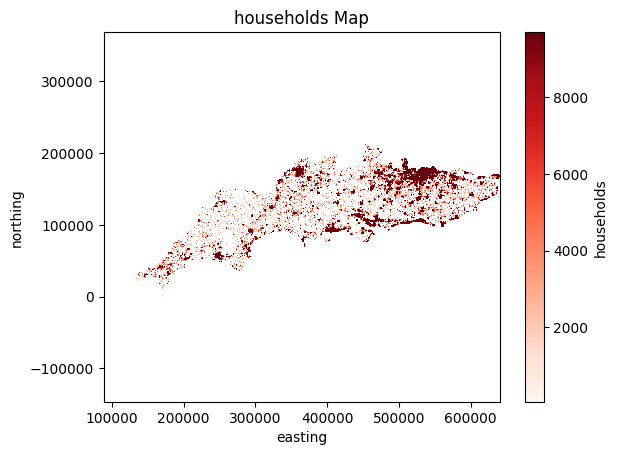

# <div style="background-color: #89CFF0; padding: 6px;"> PART ONE -- the property of UK
In this part, we use the serctor_data and postcode data to visualize. 

## 1.1 Overview of steps：
1. use `def process_proverty(sector_path,postcode_path)` to get the final dataset to plot
2. use `def plot_postcode_household_map_latlon_fig:` to visualize the data

## 1.2 household & headcount in details:
### <div style="background-color: #F0F8FF; padding: 6px;">def process_proverty(sector_path,postcode_path)

1. Observe that the postcodeSector inside the sector is of the form: xxxx x or xxx  x or xx   x, while the postcode inside the postcode is separated by only one space. The extracted sector from the postcode does not match, so we need to convert the consecutive spaces into a single space to ensure that we can make a normal connection.

    so we use the following code to process data.
    ```python
    sector_data['postcodeSector'] = sector_data['postcodeSector'].str.strip().str.upper()
    sector_data['postcodeSector'] = sector_data['postcodeSector'].str.replace(r'\s+', ' ', regex=True)
    ```
<div style="display: flex; justify-content: space-between;">
  
  
</div>


2. define `def process_proverty(sector_path,postcode_path)` function to merge sector and postcode data
    
    This function mainly maps postcodes to sectors, calculates the average population and household numbers for each postcode, and returns a dataframe containing postcode, latitude, longitude, sector information, and population and household data.

    in order to get the proverty data to plot directly

    Detailed Steps:

    1. Process sector data: Convert the values in the postcodeSector column to uppercase and remove consecutive spaces.
    2. Process postcode data: Extract the postcode sector by taking the first few digits of the postcode field, convert it to uppercase, and remove consecutive spaces; calculate the latitude and longitude for each postcode using easting and northing.
    3. Merge postcode and sector data: Join the postcode data with the sector data based on the postcode sector.
    4. Handle missing values: Particularly remove rows with missing values in the households column.
    5. Calculate average population and household numbers: Calculate the average headcount (population) and average number of households for each postcode.
    
    

### why we choose plot in postcode rather than sector
- We chose to use postcode for plotting because we plotted postcode and sector separately before wrapping the function. You can see that the sector has less data and doesn't perform well in the image, so ditch the sector and just wrap the postcode drawing function into flood_tool.

<div style="display: flex; justify-content: space-between;">
  
  
</div>
<div style="display: flex; justify-content: space-between;">
  
  
</div>


### <div style="background-color: #F0F8FF; padding: 6px;">def plot_postcode_household_map_latlon_fig(risk_data, coordinate=['longitude', 'latitude'], dx=0.01,figsize=(10, 10), save_to_bytes=False):

- Plots a household density map for postcodes using latitude and longitude coordinates.

    <mark>The value of main parameter and why we choose</mark>

- **dx=0.01**,because we want to show the postcode density map in the UK, the data set is quite big, we want to plot the map quickly and clearly
- **camp=plt.cm.Oranges**, because we want to show the headcount density map, the deeper the color, the higher the headcount, so we choose the color map Oranges
- **norm: use LogNorm to norm**, cause the headcount data has a large range, we want to show the headcount density map more clearly, so we use LogNorm 

### <div style="background-color: #F0F8FF; padding: 6px;">def plot_postcode_headcount_map_latlon_fig(risk_data, coordinate=['longitude', 'latitude'], dx=0.01,figsize=(10, 10), save_to_bytes=False):

- Plots a headcount density map for postcodes using latitude and longitude coordinates.

    <mark>The value of main parameter and why we choose</mark>
    
- **dx=0.01**,because we want to show the postcode density map in the UK, the data set is quite big, we want to plot the map quickly and clearly
- **camp=plt.cm.Oranges,** because we want to show the headcount density map, the deeper the color, the higher the headcount, so we choose the color map Oranges
- **norm: use LogNorm to norm**, cause the headcount data has a large range, we want to show the headcount density map more clearly, so we use LogNorm 


## 1.3 house price in details
as the house price is in postcode_labelled, so don't need any other specific processing.

### <div style="background-color: #F0F8FF; padding: 6px;">plot_houseprice_map_latlon_fig(risk_data,coordinate=['longitude', 'latitude'], dx=0.01,figsize=(10, 10), save_to_bytes=False):
- plot a raster map of houseprice

    <mark>The value of main parameter and why we choose</mark>

- **dx=0.01**,because we want to show the postcode density map in the UK, the data set is quite big, but we want to plot the map quickly and clearly
- **cmap=plt.cm.coolwarm**, Since we have multiple points inside a grid, we get the price range in a grid is extremly large. If we use a single gradient colour, we find that it is not obvious. Some points that have lower proce are barely noticeable. So we use a coolwarm scheme to identify each area no matter the price is high or low, as the more blue the point is, the lower the price is. the reder the point is, the higher the price is. 
- **norm: use LogNorm to norm**, cause the number of floods that have occurred in a grid from nearly 10^4 to over 10^7, We want to identify the whole price , so compressing the data range


# <div style="background-color: #89CFF0; padding: 6px;"> PART TWO -- flood event

## 2.1 overview of steps:
1. use `flood_data(flood_path)` to process data 
2. use `plot_historical_flood_map_latlon_fig` to visualize


## 2.2 flood in details

###  <div style="background-color: #F0F8FF; padding: 6px;">flood_data(flood_path)
- This function is used to read historical flood data and get the latitude and longitude of the flood data by easting and northing

- to generate the data to plot

###  <div style="background-color: #F0F8FF; padding: 6px;">plot_historical_flood_map_latlon_fig(risk_data, coordinate=['longitude', 'latitude'], dx=0.01,figsize=(10, 10), save_to_bytes=False): 

- Plots a historical flood map for postcodes using latitude and longitude coordinates.

     <mark>The main steps and why we process like this</mark>

- **dx=0.01**,because we want to show the postcode density map in the UK, the data set is quite big, we want to plot the map quickly and clearly
- **cmap=plt.cm.coolwarm**, Since we have multiple points inside a grid, we get the number of floods that have occurred in a grid from 30+ to 0. If we use a single gradient colour, we find that it is not obvious. Some points that have only happened once or twice are barely noticeable. So we use a coolwarm scheme to identify each area where flooding has occurred as much as possible.
- **norm: use LogNorm to norm**, cause the number of floods that have occurred in a grid from 30+ to 0. We want to identify as many places as possible where flooding has occurred, so compressing the data range


# <div style="background-color: #89CFF0; padding: 6px;"> PART THREE -- potential areas at risk & risk areas
In this part, we use the wet_day and typical_day to predict the potential areas at risk.

## 3.1 Overview of steps：

1. we use `tidal_risk`,`river_risk`,`get_rainfall_class` to process the data, and get the final dataset to plot
2. use `plot_risk_map_latlon_fig` to plot risk map
3. use `potential_map`  and `update_map` to plot the potential risk map


## 3.2 rainfall in details
### <div style="background-color: #F0F8FF; padding: 6px;">preprocess_day(path)

- Preprocesses the data for a single day by cleaning and filtering it.

    <mark>The main steps and why we process like this</mark>

- we find that when parameter=level there are some column's unitName='m', is doesn't make sense, so we choose to filter columns with appropriate unitName based on parameter.
    ```python
    df_filtered = df[((df['parameter'] == 'level') & (df['unitName'].isin(['mAOD', 'mASD']))) |
                 ((df['parameter'] == 'rainfall') & (df['unitName'].isin(['mm', 'm'])))]
    ```

    

- we find that 'value' column has values that are not numeric, so we use to_numeric
    ```python
    df['value'] = pd.to_numeric(df['value'], errors='coerce')
    ```
    
- Since rainfall is greater than 0, we remove the rows when parameter=rainfall, but value is less than 0
    ```python
        df_cleaned = df_filtered[(df_filtered['parameter'] != 'rainfall') | (df_filtered['value'] >= 0)]
    ```

### <div style="background-color: #F0F8FF; padding: 6px;">process_day_rainfall(day_data)
- Processes daily rainfall data to calculate the mean, max, and min rainfall for each station. It also computes the difference between max and min values.

    <mark>The main steps and why we process like this</mark>

- as different station have many columns in the dataset, so we need to calculate the mean max min to see process the data. The aim is to have only one line per site

    ```python
    rainfall_data=rainfall_data.groupby('stationReference')['value'].agg(['mean', 'max', 'min'])
    ```

### <div style="background-color: #F0F8FF; padding: 6px;">wet_typical_concat(rainfall_typical,rainfall_wet)
- Concatenates typical day rainfall data with wet day rainfall data, retainingall stations from the wet day and adding stations from the typical day that are not already in the wet day data.

    <mark>The main steps and why we process like this</mark>

- When we processed wet_day and typical_day, we found that according to the rainfall rating in the FullProjectDescription document, the point rating inside the typical_day is almost SLIGHT, while wet_day has a relatively good distribution. Because wet_day and typical_day are different days' data, considering the above data distribution, and there are duplicated and non-duplicated station parts in the two tables, in order to show as many stations as possible and keep the parts with high rainfall ratings, we take wet_day as the main table, and combine the data that are not in wet_day but in typical_day. We combine the data that are not in wet_day but are in typical_day to get a comprehensive rainfall data table.
    ```python
    new_stations = rainfall_typical[~rainfall_typical['stationReference'].isin(rainfall_wet['stationReference'])]
    # Retain all stations in the wetday, add stations not in the wetday but observed on the typical day to the wetday
    station_rainfall = pd.concat([rainfall_wet, new_stations], ignore_index=True)
   ```
    


### <div style="background-color: #F0F8FF; padding: 6px;">station_rainfall_loc(rainfall_data,station_loc)
- Merges rainfall data with station location data by processing and enriching the station location information (including converting GPS to easting/northing).

    <mark>The main steps and why we process like this</mark>

- in order to get the location of stations

### <div style="background-color: #F0F8FF; padding: 6px;">classify_rainfall(rainfall_value)
- classify the rainfall by the table:

    | Class | Flood event|
    |:-----:| :---------:|
    | 7   | 5%+|
    | 6   | 3%|
    | 5   | 2% |
    | 4   | 1% |
    | 3 |  0.5% |
    | 2 | 0.2% |
    | 1 | 0.1% or smaller |

    <mark>The main steps and why we process like this</mark>

- Getting a rainfall classification


### <div style="background-color: #F0F8FF; padding: 6px;">classify_rainfall_encode(rainfall_class):

- Converting text grades to numbers

    <mark>The main steps and why we process like this</mark>

-  for larger rainfall get the higher class and enocode


### <div style="background-color: #F0F8FF; padding: 6px;">get_rainfall_class(typical_path,wet_path,station_path):
- Processes rainfall data for typical and wet days, merges with station location data, and classifies the rainfall based on mean and max values. 

    <mark>The main steps and why we process like this</mark>


- Call all the above processing functions to get the final dataset for plotting


## 3.3 tide in details:
###  <div style="background-color: #F0F8FF; padding: 6px;">get_tidal_change(tidal)
- Analyse the tidal data, find the unusual tidal data

     <mark>The main steps and why we process like this</mark>

- We processes tidal data to identify unusual patterns or changes in tidal levels, which may allow for detecting significant variations in tidal levels, which can be further analyzed for anomalies or trends.
For each station, it calculates the difference between consecutive tidal values (value_diff) and the absolute magnitude of these differences (value_change). 
    ```python
    # calculate the difference between the current value and the previous value
    tidal['value_diff'] = tidal.groupby('stationReference')['value'].diff()

    #  calculate the absolute value of the difference
    tidal['value_change'] = tidal['value_diff'].abs()
    ```
###  <div style="background-color: #F0F8FF; padding: 6px;"> calculate_tidal_threshold(group, k=2)
- Calculate a tidal anomaly threshold based on mean and standard deviation of differences.

     <mark>The main steps and why we process like this</mark>

- By plotting these graphs, we can visually observe that tidal changes exhibit a certain periodicity, making it easier to identify and analyze patterns or anomalies in the data.This approach allows for easy identification of unusual patterns or significant tidal changes in specific locations.

<div style="display: flex; justify-content: space-between;">
  
  
  
</div>

- This method assumes the data follows a roughly normal distribution (common in many natural processes). In a normal distribution:95% lies within 2 standard deviations.This function calculates a threshold for detecting significant or unusual changes in tidal data based on statistical properties of the data within each group. Threshold Formula (mean_diff + k * std_diff):Adding a multiple of the standard deviation (k * std_diff) to the mean helps define a boundary for unusual changes.

### <div style="background-color: #F0F8FF; padding: 6px;">flag_anomalies(group,thresholds)
- Flag anomalies in a dataset based on a precomputed threshold.

### <div style="background-color: #F0F8FF; padding: 6px;">tidal_risk(station,wet,typical)
-  Calculate and identify tidal risk anomalies based on water level data.


## 3.4 river in details:
###  <div style="background-color: #F0F8FF; padding: 6px;"> river_risk(station,wet,typical):
- Calculate river flood risk based on water level data from typical and wet days.


## 3.5 risk in details
###   <div style="background-color: #F0F8FF; padding: 6px;">plot_risk_map_latlon_fig
- This function generates a risk map for a given dataset of geographic coordinates and associated risk labels (values). It visualizes the data on a 2D grid and overlays a country boundary. 

     <mark>The main steps and why we process like this</mark>
     
- We defines the minimum and maximum bounds of the grid based on the data.   

- And then caculte the grid.The grid resolution (dx) determines how many grid cells are needed to cover the entire bounding box. So we generates 2D arrays for the grid's x and y coordinates.
- The loop iterates over each data point, calculates the corresponding grid indices (i for x and j for y), and assigns the risk value (riskLabel) to the grid cell，filling the Grid with Risk Values.
- We also add Country Borders.The shapefile for world countries is loaded using geopandas, and the United Kingdom is extracted from this shapefile.

## 3.6 plot in details:

### <div style="background-color: #F0F8FF; padding: 6px;">potential_map(typical_path,wet_path,station_path)
- This function preprocesses data from multiple sources and generates a potential risk area map for the UK. It combines river, rainfall, and tidal risk information to identify regions with significant risk markers.

     <mark>The main steps and why we process like this</mark>

- **1. process river, rainfall, and tidal data** by using previous funtion(`river_risk`, `get_rainfall_class`, `tidal_risk`) 

- **2. Extracts** station references, coordinates, and risk indicators for each type of risk.

- **3. Merges the datasets：** find the concatenation of the three datasets, with overlapping rows for risk stacking. Filling missing values with 0 and ensuring consistent latitude and longitude information.

    - **reasons:** in order to provide a comprehensive assessment of the risk area, we overlay different types of data is intended to bring together multiple possible sources of flood risk
    - **reasons:** make ensure that records from each site are retained,we use Outer Join to merge the three datasets by site number, even if some sites exist only in part of the dataset.
    - **reasons:** in order to highlights the areas where the risks are superimposed, we create a new column mark to get the cumulative risk value by adding river_mark, rainfall_mark and tidal_mark. 

- **4. Risk Mark Calculation:** Computes a combined mark column by summing individual risk indicators (river_mark, rainfall_mark, tidal_mark).

- **5. Filters** the dataset to include valid geographic coordinates.

- **6. Visualization:** Plots the potential risk map using plot_potential_risk_latlon_fig, highlighting areas with higher cumulative risk.
    
###  <div style="background-color: #F0F8FF; padding: 6px;">update_map(R_min_filter, R_max_filter)
- We create an interactive risk map using folium and ipywidgets, making it easier to explore and analyze spatial risk patterns.

     <mark>The main steps and why we process like this</mark>

- Since displaying all postcodes at once can be overwhelming, the interactive map includes slider widgets to filter points based on their risk values (R_min_filter and R_max_filter).   
- The update_map function  generates a map based on user-defined risk thresholds (R_min_filter and R_max_filter). Points on the map represent locations, and their colors are determined by a color scale from matplotlib, reflecting the risk values.   
- Users can adjust the risk thresholds using the slider widgets (R_min_widget and R_max_widget), and the map updates in real-time to display only the points that fall within the selected range. 


# <div style="background-color: #89CFF0; padding: 6px;"> PART FOUR -- economic and human risk map
## notes
Really sorry but we don't have enough time to plot economic risk map and human risk map after finised the two estimate function in tool.py, so I'll just write some code about how we plan to plot the two maps. This may have bugs, but we've tried our best.

Just use the formula: $$ R := 0.05 \times (\textrm{total property value}) \times(\textrm{flood probability}) $$
and $$ H := 0.1 \times (\textrm{total population}) \times(\textrm{flood probability}) $$, 
we multiply property value and human risk estimated by estimate_total_value and estimate_annual_human_flood_risk of each postcode point and flood probability to calculate R value of each postcode point. Then plot a map.


### economic risk map

```python
postcode_list=pt['postcode']
R_mark=ft.tool.estimate_total_value(postcode_list)*pt['riskLabel']*0.05
pt['R_mark']=R_mark
ft.plot_economic_map_latlon_fig(pt,dx=0.01,figsize=[20,5])
#The plot_economic_map_latlon_fig function is just like plot_houseprice_map_latlon_fig
#but we don't have enough time to put it in .py files and merge agian, so I just put it here
#The code of this function is nearly the same as plot_houseprice_map_latlon_fig,just change the title and legend of the map
#and change the columns of 'houseprice' to 'R_mark'
```

### human risk map
```python
postcode_list=pt['postcode']
H_mark=ft.tool.estimate_total_value(postcode_list)*pt['riskLabel']*0.05
pt['H_mark']=H_mark
ft.estimate_annual_human_flood_risk(pt,dx=0.01,figsize=[20,5])
#The estimate_annual_human_flood_risk function is just like plot_houseprice_map_latlon_fig
# but we don't have enough time to put it in .py files and merge agian, so I just put it here
# The code of this function is nearly the same as plot_houseprice_map_latlon_fig,just change the title and legend of the map
# and change the columns of 'houseprice' to 'H_mark'
```
